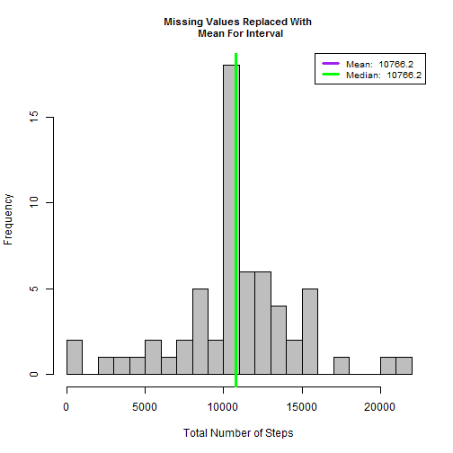

## Loading & Preprocessing Data
1. Load Data
2. Process data to data.table

```r
# Load the required packages
library(data.table)
```

```
## data.table 1.9.4  For help type: ?data.table
## *** NB: by=.EACHI is now explicit. See README to restore previous behaviour.
```

```r
library(ggplot2)
library(lattice)
library(knitr)

# Load the data
Mydata = read.csv('C:\\Users\\KTHTAG\\Desktop\\activity.csv', header = T)

# Process/transform the data (if necessary) into a format suitable for further analysis, in this case - data.table
Mydata_tbl = data.table(Mydata)
Mydata_tbl_summary = Mydata_tbl[, list(total_steps = sum(steps,                                                  na.rm = T)), by = date]
```

## What is mean total number of steps taken per day?
1. Make a histogram of the total number of steps taken each day
2. Calculate and report the mean and median total number of steps taken per day
Note: Mean and Median are reported In Legend Of Histogram

Calculate and display mean and median

```r
mean_value   = round(mean(Mydata_tbl_summary$total_steps), 1)
median_value = round(median(Mydata_tbl_summary$total_steps), 1)
mean_value
```

```
## [1] 9354.2
```

```r
median_value
```

```
## [1] 10395
```


```r
gen_hist = function(x, title){
        hist(x, 
             breaks = 20,
             main = title,
             xlab = 'Total Number of Steps', col = 'grey',

             cex.main = .9)

        #calculate mean and median
        mean_val   = round(mean(x), 1)
        median_val = round(median(x), 1)
        
        
        #place lines for mean and median on histogram
        abline(v=mean_val, lwd = 3, col = 'purple')
        abline(v=median_val, lwd = 3, col = 'green')

        #create legend
        legend('topright', lty = 1, lwd = 3, 
               col = c("purple", "green"),
               cex = .8, 
               legend = c(paste('Mean: ', mean_val),
               paste('Median: ', median_val))
               )
}

gen_hist(Mydata_tbl_summary$total_steps, 'Number of Steps Taken Per Day')
```

 

## What is the average daily activity pattern?
1. Make a time series plot (i.e. type = "l") of the 5-minute interval (x-axis) and the average number of steps taken, averaged across all days (y-axis)

2. To find out Which 5-minute interval, on average across all the days in the dataset, contains the maximum number of steps?

Note: Maximum number of steps also reported In Legend Of Time Series Plot

```r
#summarize dataset by interval
Mydata_tbl_summary_intv = Mydata_tbl[, list(avg_steps = mean(steps, 
                                     na.rm = T)), by = interval]

#plot the time series
with(Mydata_tbl_summary_intv, {
        plot(interval, avg_steps, type = 'l',
             main = 'Average Steps by Time Interval',
             xlab = '5 Minute Time Interval',
             ylab = 'Average Number of Steps')
        })
#Find Interval That Has The Maximum Avg Steps
max_steps = Mydata_tbl_summary_intv[which.max(avg_steps), ]

#Display max_steps
max_steps
```

```
##    interval avg_steps
## 1:      835  206.1698
```

```r
#Generate Label String
max_lab = paste('Maximum Of ', round(max_steps$avg_steps, 1), ' Steps \n On ', max_steps$interval, 'th Time Interval', sep = '')

#Collect Cooridinates of The Max Interval For Graphing
points(max_steps$interval,  max_steps$avg_steps, col = 'green', lwd = 3, pch = 19)

#Add Label To Annotate Maximum # Steps And Interval
legend("topright",
       legend = max_lab,
       text.col = 'green',
       bty = 'n'
       )
```

 
## Imputing missing values
1. Calculate & Report The Number of Missing Values

```r
sum(is.na(Mydata$steps))
```

```
## [1] 2304
```

2. Devise a strategy for filling in all of the missing values in the dataset. The strategy does not need to be sophisticated. For example, you could use the mean/median for that day, or the mean for that 5-minute interval, etc.

3. Create a new dataset that is equal to the original dataset but with the missing data filled in.

```r
#First join the dataframe that summarizes the average number of steps per interval to the original dataset
setkey(Mydata_tbl, interval)
setkey(Mydata_tbl_summary_intv, interval)


#Create function that will return the second value if the first value is NA
NA_replace = function(x,y){
        if(is.na(x)){

                return(y)
        }
        return(x)
}

#create new dataset that replaces NAs with average values
Mydata_tbl_miss = Mydata_tbl[Mydata_tbl_summary_intv]
Mydata_tbl_miss$new_steps = mapply(NA_replace, Mydata_tbl_miss$steps, Mydata_tbl_miss$avg_steps)

#summaryize new dataset by day
Mydata_tbl_summary_miss = Mydata_tbl_miss[, list(new_steps = sum(new_steps, 
                                                 na.rm = T)), by = date]
#preview new dataset
head(Mydata_tbl_summary_miss)
```

```
##          date new_steps
## 1: 2012-10-01  10766.19
## 2: 2012-10-02    126.00
## 3: 2012-10-03  11352.00
## 4: 2012-10-04  12116.00
## 5: 2012-10-05  13294.00
## 6: 2012-10-06  15420.00
```

4. Make a histogram of the total number of steps taken each day AFTER missing values were imputed.
Note: Mean and Median are reported In Legend Of Histogram


```r
gen_hist(Mydata_tbl_summary$total_steps, 'Missing Values Removed')
```

 

```r
gen_hist(Mydata_tbl_summary_miss$new_steps, 'Missing Values Replaced With \n Mean For Interval')
```

 

## Are there differences in activity patterns between weekdays and weekends?

1. Create a new factor variable in the dataset with two levels - "weekday" and "weekend" indicating whether a given date is a weekday or weekend day.


```r
#Make Function To Return Either "Weekday" or "Weekend"
weekpart = function(x){
        if(x %in% c('Saturday', 'Sunday')){
                return('Weekend')
        }
        return('Weekday')
}

#Add Name of Week
Mydata_tbl_miss$dayname = weekdays(as.Date(Mydata_tbl_miss$date))

#Add Factor Variable To Differentiate Weekday and Weekend
Mydata_tbl_miss$daytype = as.factor(apply(as.matrix(Mydata_tbl_miss$dayname), 1,                                     weekpart))

#Summarize Dataset: Mean grouped by interval and daytype
Mydata_tbl_summary_miss = Mydata_tbl_miss[, list(avg_steps = mean(new_steps, 
                                          na.rm = T)), by = list(interval,
                                          daytype)]

#inspect dataset
str(Mydata_tbl_summary_miss)
```

```
## Classes 'data.table' and 'data.frame':	576 obs. of  3 variables:
##  $ interval : int  0 0 5 5 10 10 15 15 20 20 ...
##  $ daytype  : Factor w/ 2 levels "Weekday","Weekend": 1 2 1 2 1 2 1 2 1 2 ...
##  $ avg_steps: num  2.2512 0.2146 0.4453 0.0425 0.1732 ...
##  - attr(*, ".internal.selfref")=<externalptr>
```

```r
#Generate the panel plot:
xyplot(avg_steps~interval | daytype, data = Mydata_tbl_summary_miss,
      type = 'l',
      xlab = 'Interval',
      ylab = 'Number of Steps',
      layout = c(1,2))
```

 
